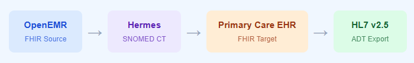

  

    
About the Project

    <h1 class="glow-text">About &amp; Presentation</h1>
    
INFO-B581 &middot; Spring 2026 &middot; Healthcare Data Interoperability ETL Pipeline

    <nav class="dark-nav">
      <strong>Navigate:</strong>
      <a href="index.html">Home</a> |
      <a href="etl_pipeline.html">ETL Pipeline</a> |
      <a href="insights.html">Insights</a> |
      <a href="team_contributions.html">Team Contributions</a> |
      <a href="about.html" style="color:#ffffff!important;text-shadow:0 0 10px #4db8ff;text-decoration:none;">About / Presentation</a>
    </nav>
  

---

## About the Team

Our three-member team project for INFO-B581 (Spring 2026) developed a Python-based healthcare ETL pipeline showcasing FHIR interoperability, SNOMED CT mapping, validation, and HL7 v2 messaging using realistic clinical training data.

| Member | Role |
|---|---|
| Zhenan Yin | ETL Lead - Tasks 1, 2, 3, GitHub setup, team coordination |
| Aiswarya Perumbilly | Website &amp; Content Lead - Task 4, website design, presentation |
| Kelli Davis | Interoperability Lead - Task 5, HL7 messaging, terminology mapping, testing |

---

## Introduction

Healthcare systems often struggle to exchange data due to incompatible formats, standards, and protocols, so our project created an end-to-end healthcare ETL workflow that transfers, standardizes, and validates patient data across interoperable systems using modern healthcare standards.

1. **Data Extraction** - Retrieved Patients, Conditions, Observations, and Procedures from OpenEMR.
2. **Terminology Transformation** - Used Hermes SNOMED CT for parent/child concept mapping.
3. **Resource Loading** - Created standardized resources in the Primary Care FHIR server.
4. **Validation** - Verified Patient and Condition resources using $validate.
5. **Interoperability Output** - Generated HL7 v2 ADT message for legacy systems.
6. **Project Outcome** - Demonstrated automated healthcare ETL using Python.

### What is a FHIR API?

- FHIR (Fast Healthcare Interoperability Resources) is the standard used in our project to exchange healthcare data electronically through simple REST APIs and JSON between OpenEMR and the Primary Care FHIR server.
- We used key FHIR resources such as Patient, Condition, Observation, and Procedure to transfer, standardize, and validate clinical data securely across systems.

### Our Pipeline at a Glance

**Patient followed throughout:** Katherine Schroeder  &middot; DOB 1951-10-26

---

## Task 1 - Patient + Parent Condition

  Task 1
  Extract &rarr; Transform (IS-A Parent) &rarr; Load &rarr; Validate

**EXTRACT:** 
- Searched OpenEMR patients using FHIR search parameters:
  `gender=female&birthdate=gt1951-01-01&_lastUpdated=gt2020-01-01`.
- Retrieved patient conditions and selected valid disorder: Anemia.
- Identified SNOMED CT code: 271737000.

**TRANSFORM:** 
- Queried Hermes terminology server for parent SNOMED concept.
- Found parent concept: Disorder of cellular component of blood-414022008(SNOMED CT concept ID).
- Mapped the diagnosis (Anemia) to its broader SNOMED CT parent concept for ETL transformation.

**LOAD:** 
- A new Patient and Parent Condition were created in the Primary Care FHIR server and successfully validated using `$validate`.

### Terminal Output

<pre class="terminal-pre">
Step 1: GET /Patient?gender=female&birthdate=gt1951-01-01&_lastUpdated=gt2020-01-01
Total patients found: 5118
  [0] 9d035918-b974-4996-b35f-4b913d70f9fd | Katherine Schroeder | DOB: 1951-10-26
Step 2: Conditions for patient - 132 total
  [3] Anemia (disorder) selected
  Hermes → Found: 271737000 | Anemia
Step 3: Parent lookup for SNOMED 271737000
  Direct parent concept ID: 414022008
  Parent preferred term: Disorder of cellular component of blood
Step 4: Patient created → Primary Care Patient ID: {ID}
Step 5: Condition created → Primary Care Condition ID: {ID}
Validation Patient   → POST /Patient/$validate   → 200 PASSED
Validation Condition → POST /Condition/$validate → 200 PASSED
</pre>

- The system searched OpenEMR, selected **Katherine Schroeder**, identified her **Anemia** condition, and used Hermes to find the parent SNOMED concept.
- After that, a new **Patient** and **Condition** were created in the Primary Care FHIR server, and both resources passed validation successfully (**HTTP 200**).
  

  

    Source SNOMED
    271737000 - Anemia
  

  

    Parent SNOMED
    414022008 - Disorder of cellular component of blood
  

  

    Patient ID
    {ID}
  

  

    Condition ID
    {ID}
  

  

    Validation
    HTTP 200 PASSED
  

---

## Task 2 - Create Child Condition

  Task 2
  Extract &rarr; Transform (ECL Child) &rarr; Load &rarr; Validate

**EXTRACT:** 
- Retrieved Katherine Schroeder’s Condition records from OpenEMR.
- Selected a valid clinical diagnosis: Essential hypertension (SNOMED CT: 59621000).

**TRANSFORM:** 
- Queried Hermes using child concept (ECL) lookup.
- Mapped to a more specific child concept: 1201005 - Benign essential hypertension.

**LOAD:** 
- Created a new Condition resource on the Target FHIR server.
- Successfully validated the resource using `$validate`.

### Terminal Output

<pre class="terminal-pre">
Step 3: Selecting disorder (skipping 'Anemia')
  Found: 59621000 | Essential hypertension
Step 4: Child concept for SNOMED 59621000
  Child concept ID:   1201005
  Child concept term: Benign essential hypertension
Step 5: Condition ID {ID} - linked to Patient {ID}
Validation → HTTP 200 PASSED 
</pre>

- The system selected Essential hypertension as the next valid diagnosis.
- Hermes was used to find a more specific child concept, returning **1201005 - Benign essential hypertension.**
- A new Condition resource was created for Patient and passed validation successfully (**HTTP 200**).

  
Source SNOMED59621000 - Essential hypertension

  
ECL Query&lt;!59621000

  
Child SNOMED1201005 - Benign essential hypertension

  
Condition ID{ID}

  
ValidationHTTP 200 PASSED

---

## Task 3 - Blood Pressure Observation

  Task 3
  Extract (check OpenEMR) &rarr; Transform (JSON Source) &rarr; Load

**EXTRACT:** 
- Retrieved Katherine Schroeder’s Blood Pressure record from OpenEMR.
- Since FHIR values were missing, used source vitals 124/73 mmHg.
  
**TRANSFORM:** 
- Loaded the prepared JSON Observation file (`observation_task3.json`).
- Updated the subject reference to target patient record.

**LOAD:** 
- Created a new Blood Pressure Observation on the Target FHIR server.
- Successfully saved the output locally.

### Terminal Output

<pre class="terminal-pre">
GET /Observation?patient=9d035918...&amp;category=vital-signs&amp;code=85354-9
Blood Pressure Observations found: 1

BP record found but values are absent (dataAbsentReason: unknown).
OpenEMR FHIR API does not expose actual vitals values.

Loaded BP Observation from data/observation_task3.json
Systolic  (LOINC 8480-6): 124 mmHg
Diastolic (LOINC 8462-4):  73 mmHg

Observation updated successfully.
Primary Care Observation ID: {ID}
</pre>

- The system confirmed that **Blood Pressure Observation** existed in OpenEMR.
- Since the values were unavailable in the API response, the JSON document was used.
- A new Observation resource was created successfully in the Primary Care FHIR server.

  
LOINC85354-9 - Blood pressure panel

  
OpenEMR Status1 found - values absent

  
Values Used124 / 73 mmHg

  
JSON Sourceobservation_task3.json

  
Observation ID{ID}

---

## Task 4 - Procedure

**EXTRACT:** 
- Checked Procedure records for Katherine Schroeder in OpenEMR.
- No existing Procedure resources were found for this patient.

**TRANSFORM:** 
- Prepared a Procedure JSON template based on the patient’s Anemia history.
- Selected Intravenous blood transfusion of packed cells as a clinically relevant procedure.
  
**LOAD:** 
- Posted a new Procedure resource on the Target FHIR server linked to the patient.
- Confirmed successful creation and stored the generated Procedure ID.

### Terminal Output

<pre class="terminal-pre">
GET /Procedure?patient=9d035918-b974-4996-b35f-4b913d70f9fd
Procedures found in OpenEMR: 0

No Procedures found in OpenEMR.
A new clinically relevant procedure will be created from the JSON document.

Loaded Procedure from data/procedure_task4.json
Procedure: Intravenous blood transfusion of packed cells (SNOMED: 180207008)

Procedure created → Primary Care Procedure ID: ID
Status: completed | Performed: 2010-12-17
</pre>

  
Procedures in OpenEMR0 found

  
JSON Sourceprocedure_task4.json

  
ProcedureBlood transfusion of packed cells

  
SNOMED180207008

  
Procedure ID{ID}

---

## Task 5 - HL7 v2 ADT Message Generation

**EXTRACT:** 
- Retrieved Katherine Schroeder’s demographic details and diagnosis Anemia (SNOMED 271737000) from OpenEMR for message creation.  

**TRANSFORM:** 
- Used Hermes to map SNOMED CT 271737000 to ICD-10 D64.9 and converted the patient data into an HL7 v2 **ADT^A01** message with MSH, PID, PV1, and DG1 segments.  

**LOAD:** 
- Exported the completed HL7 message successfully as **task5_adt.txt**.
- Enabled compatibility with legacy healthcare systems using HL7 format.

  Task 5
  Extract &rarr; Transform (SNOMED &rarr; ICD-10) &rarr; Build HL7 &rarr; Export

### Generated HL7 Message

<pre>
MSH|^~\&|OpenEMR|IU_Health|PrimaryCareEHR|PrimaryCare|20260413155439||ADT^A01|MSG00001|P|2.5
PID|||9d035918-b974-4996-b35f-4b913d70f9fd||Schroeder^Katherine||19511026|F|||^^Leominster^Massachusetts
PV1||I|ICU^101^A|||||||||||||||||||||||||||||||||||||||||20260413155439
DG1|1||D64.9^Anemia^I10||20260413155439|A
</pre>

### Segment Breakdown

| Segment | Purpose | Key Values |
|---|---|---|
| MSH | Message header | Sender OpenEMR, receiver PrimaryCareEHR, message type **ADT^A01** |
| PID | Patient identification | Name, DOB, gender, and address |
| PV1 | Patient visit | Inpatient status (I) and assigned ICU room ICU^101^A |
| DG1 | Diagnosis | ICD-10 code (auto mapped) **D64.9** and Anemia |

### Why This Supports Legacy Interoperability

- Converts modern FHIR patient data into **HL7 v2** format used by older hospital systems.
- Helps systems like lab, radiology, and billing communicate without using FHIR directly.
- ICD-10 code **D64.9** was mapped automatically from SNOMED using Hermes.
- Reduces manual coding errors and improves data exchange.
- Final message was saved as **task5_adt.txt**.

  
SNOMED271737000 - Anemia

  
ICD-10 mappedD64.9 (Hermes mapping)

  
HL7 typeADT^A01 v2.5

  
SegmentsMSH · PID · PV1 · DG1

  
Outputtask5_adt.txt ✓

---

## Complete Results Summary

| Task   | Resource         | Key Values                                                                 | Status              |
|--------|------------------|----------------------------------------------------------------------------|---------------------|
| Task 1 | Patient          | Katherine Schroeder · DOB 1951-10-26                                      | Validated HTTP 200  |
| Task 1 | Parent Condition | SNOMED 414022008 - Disorder of cellular component of blood                | Validated HTTP 200  |
| Task 2 | Child Condition  | SNOMED 1201005 - Benign essential hypertension                            | Validated HTTP 200  |
| Task 3 | BP Observation   | 124/73 mmHg · LOINC 85354-9                                               | Created             |
| Task 4 | Procedure        | SNOMED 180207008 - Intravenous blood transfusion of packed cells · 2010-12-17 | Created         |
| Task 5 | HL7 v2.5 ADT     | ICD-10 D64.9 ← SNOMED 271737000 (Anemia)                                  | Exported            |

---

## Key Insights & Best Practices Applied

- Real healthcare data can be complex and inconsistent, so filtering valid conditions is important.
- SNOMED CT parent and child mappings improved diagnosis accuracy.
- Standard FHIR APIs enabled data extraction, creation, and exchange.
- Missing values were handled using fallback logic.
- FHIR resources and HL7 v2 messages demonstrated interoperability.

---

## Challenges &amp; Resolutions

| Challenge | Resolution |
|---|---|
| OAuth2 token expiry | Reloaded token before running scripts |
| Many invalid conditions | Filtered only valid disorder terms |
| Missing required fields | Added missing fields during transformation |
| BP values absent in API | Loaded actual vitals (124/73 mmHg) from JSON |
| HL7 message readability issues | Saved each segment on a new line |

---

## Conclusion - Value for a Healthcare Organization

This project demonstrates how a healthcare organization can safely transfer patient data into a new system while improving interoperability and data quality.

- **Standard terminology** keeps diagnoses consistent across systems.
- **Automatic ICD-10 mapping** reduces manual coding work and errors.
- **Validation checks** improve data quality before loading records.
- **HL7 v2 output** helps older systems continue to communicate.
- **Sequential IDs** confirm resources were created successfully.

This ETL pipeline creates a repeatable and reliable process for healthcare data exchange - a foundation for ongoing clinical data interoperability.

