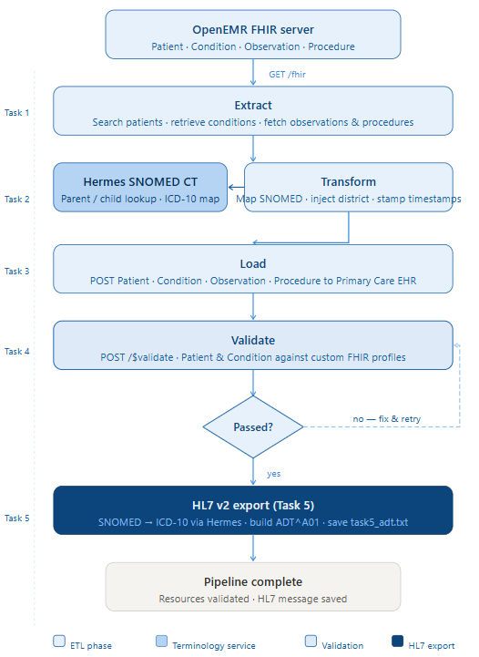
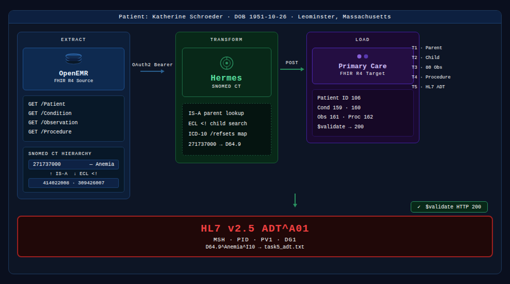

<style>
h2 { color:#22c55e !important; font-size:34px; font-weight:800; margin-top:40px; }
h3 { color:#22c55e !important; font-size:26px; font-weight:700; }

/* ── HEADER ── */
.immersive-header-container {
  background: linear-gradient(135deg, #020c1b 0%, #0a2a5e 60%, #0d3d6b 100%);
  color: #fff;
  margin-left: -30px; margin-right: -30px;
  padding: 2.5rem 1.5rem 2rem;
  border-radius: 0 0 24px 24px;
  box-shadow: 0 12px 40px rgba(0,0,0,0.5);
  margin-bottom: 3rem;
}
.header-content-wrapper { max-width: 920px; margin: 0 auto; text-align: center; }
.header-badge { display: inline-block; background: rgba(0,180,255,0.15); border: 1px solid rgba(0,180,255,0.4); color: #7dd3fc; font-size: 0.78rem; font-weight: 700; letter-spacing: 0.12em; text-transform: uppercase; padding: 0.3rem 1rem; border-radius: 100px; margin-bottom: 1rem; }
.glow-text { color: #fff; text-shadow: 0 0 30px rgba(0,150,255,0.8); margin: 0.5rem 0 0.6rem; font-size: 2.2rem; font-weight: 800; }
.header-subtitle { color: #93c5fd; font-size: 0.95rem; margin-bottom: 1.4rem; }
.dark-nav { background: rgba(255,255,255,0.05); border: 1px solid rgba(255,255,255,0.15); padding: 0.7rem 1.2rem; border-radius: 50px; color: #ccc; display: inline-block; backdrop-filter: blur(8px); font-size: 0.9rem; }
.dark-nav strong { color: #fff; margin-right: 6px; }
.dark-nav a { color: #4db8ff !important; text-decoration: none; padding: 0 5px; transition: all 0.25s; }
.dark-nav a:hover { color: #fff !important; text-shadow: 0 0 10px #4db8ff; }

/* ── SERVER CARDS ── */
.server-grid { display: grid; grid-template-columns: repeat(auto-fit, minmax(220px,1fr)); gap: 1rem; margin: 1.5rem 0 2.5rem; }
.server-card { border-radius: 12px; padding: 1.2rem 1.4rem; border-left: 5px solid; }
.server-card.source { background: #eff6ff; border-color: #2563eb; }
.server-card.terminology { background: #f0fdf4; border-color: #16a34a; }
.server-card.target { background: #fdf4ff; border-color: #9333ea; }
.server-label { font-size: 0.65rem; font-weight: 800; letter-spacing: 0.15em; text-transform: uppercase; color: #64748b; margin-bottom: 0.3rem; }
.server-name { font-weight: 700; color: #1e293b; margin-bottom: 0.4rem; font-size: 0.95rem; }
.server-card code { font-size: 0.72rem; color: #475569; word-break: break-all; }

/* ── TERMINAL OUTPUT ── */
.output-block { background: #0f172a; border-radius: 12px; margin: 1.2rem 0; border: 1px solid #1e293b; overflow: hidden; }
.output-label { display: block; background: #1e293b; color: #94a3b8; font-size: 0.72rem; font-weight: 700; text-transform: uppercase; letter-spacing: 0.1em; padding: 0.5rem 1rem; }
.output-pre {
  display: block !important;
  margin: 0 !important;
  padding: 1.2rem 1.4rem !important;
  color: #e2e8f0 !important;
  background: #0f172a !important;
  font-family: Consolas, Monaco, 'Courier New', monospace !important;
  font-size: 0.82rem !important;
  line-height: 1.75 !important;
  white-space: pre !important;
  overflow-x: auto !important;
  overflow-y: visible !important;
  max-height: none !important;
  height: auto !important;
  border: none !important;
  border-radius: 0 !important;
  box-shadow: none !important;
  word-break: normal !important;
}

/* ── HL7 BLOCK ── */
.hl7-block { background: #0c1a2e; border-radius: 12px; padding: 0; margin: 1.2rem 0; overflow: hidden; border: 1px solid #1e3a5f; }
.hl7-block pre { margin: 0; padding: 1rem; color: #7dd3fc; font-size: 0.85rem; line-height: 1.8; overflow-x: auto; background: transparent; }

/* ── RESULT CARDS ── */
.etl-result-grid { display: grid; grid-template-columns: repeat(auto-fit, minmax(220px,1fr)); gap: 1rem; margin: 1.2rem 0; }
.result-card { border-radius: 12px; padding: 1.2rem; }
.extract-card { background: #eff6ff; border-top: 4px solid #2563eb; }
.transform-card { background: #fefce8; border-top: 4px solid #ca8a04; }
.load-card { background: #f0fdf4; border-top: 4px solid #16a34a; }
.rc-label { font-size: 0.65rem; font-weight: 800; letter-spacing: 0.15em; text-transform: uppercase; margin-bottom: 0.8rem; color: #64748b; }
.rc-row { display: flex; justify-content: space-between; align-items: baseline; gap: 0.5rem; margin-bottom: 0.35rem; font-size: 0.82rem; flex-wrap: wrap; }
.rc-row span { color: #64748b; flex-shrink: 0; }
.rc-row code { background: rgba(0,0,0,0.06); padding: 0.1rem 0.4rem; border-radius: 4px; font-size: 0.78rem; color: #1e293b; }

/* ── HL7 SEGMENTS ── */
.hl7-segments { display: flex; flex-direction: column; gap: 0.8rem; margin: 1.5rem 0; }
.seg-card { background: #f8fafc; border-radius: 10px; padding: 1rem 1.2rem; border-left: 4px solid #0077cc; }
.seg-name { font-size: 0.8rem; font-weight: 800; color: #0077cc; letter-spacing: 0.1em; margin-bottom: 0.4rem; }
.seg-desc { font-size: 0.85rem; color: #334155; line-height: 1.55; }
.seg-desc code { background: #e2e8f0; padding: 0.1rem 0.3rem; border-radius: 3px; font-size: 0.8rem; }

/* ── CHALLENGES ── */
.challenges-grid { display: grid; grid-template-columns: repeat(auto-fit, minmax(280px,1fr)); gap: 1.2rem; margin: 2rem 0; }
.challenge-card { background: #fff; border-radius: 12px; padding: 1.4rem; box-shadow: 0 2px 12px rgba(0,0,0,0.07); border-left: 4px solid #0077cc; }
.challenge-card h4 { margin: 0 0 0.6rem; color: #1e293b; font-size: 0.95rem; }
.challenge-card p { margin: 0 0 0.4rem; font-size: 0.85rem; color: #475569; line-height: 1.55; }
.challenge-card code { background: #f1f5f9; padding: 0.1rem 0.3rem; border-radius: 3px; }
</style>

<div class="immersive-header-container">
  <div class="header-content-wrapper">
    <div class="header-badge">Technical Documentation</div>
    <h1 class="glow-text">ETL Pipeline Documentation</h1>
    <p class="header-subtitle">Extract · Transform · Load · Validate - Five Coding Tasks with Real Outputs</p>
    <nav class="dark-nav">
      <strong>Navigate:</strong>
      <a href="index.html">Home</a> |
      <a href="etl_pipeline.html" style="color:#ffffff!important;text-shadow:0 0 10px #4db8ff;text-decoration:none;">ETL Pipeline</a> |
      <a href="insights.html">Insights</a> |
      <a href="team_contributions.html">Team Contributions</a> |
      <a href="about.html">About / Presentation</a>
    </nav>
  </div>
</div>

## Overview

This project implements a complete **Extract-Transform-Load (ETL) pipeline** for clinical data interoperability, following a single patient : **Katherine Schroeder** - across all five tasks.



<div class="server-grid">
  <div class="server-card source">
    <div class="server-label">SOURCE</div>
    <div class="server-name">OpenEMR FHIR Server</div>
    <code>https://in-info-web20.luddy.indianapolis.iu.edu/apis/default/fhir</code>
  </div>
  <div class="server-card terminology">
    <div class="server-label">TERMINOLOGY</div>
    <div class="server-name">Hermes SNOMED CT Server</div>
    <code>http://159.203.121.13:8080/v1/snomed</code>
  </div>
  <div class="server-card target">
    <div class="server-label">TARGET</div>
    <div class="server-name">Primary Care EHR FHIR Server</div>
    <code>http://159.203.105.138:8080/fhir</code>
  </div>
</div>

---

## ETL Framework



### Extract
- Retrieved patient, condition, observation, and procedure data from OpenEMR using FHIR API queries.

### Transform
- Applied SNOMED CT parent/child mapping, handled missing values, added fallback defaults, and converted SNOMED to ICD-10 for HL7 generation.

### Load
- Created Patient, Condition, Observation, and Procedure resources in the Primary Care FHIR server, and exported the HL7 v2 ADT message as a text file.

---

## 1. Extraction

## API Endpoints Used

| Resource | Purpose |
|---|---|
| GET /Patient?gender=female&birthdate=gt1951-01-01&_lastUpdated=gt2020-01-01 | Locate matching patient |
| GET /Condition?patient=9d035918-b974-4996-b35f-4b913d70f9fd | Retrieve conditions |
| GET /Observation?...code=85354-9 | Check blood pressure |
| GET /Procedure?patient=9d035918-b974-4996-b35f-4b913d70f9fd | Check procedures |

### Authentication & Authorization

- Uses OAuth2 Bearer Token authentication to securely access the OpenEMR FHIR server.
- The access token is stored locally in data/access_token.json and added automatically to API request headers.
- Enables Python scripts to securely retrieve Patient, Condition, Observation, and Procedure data.

```python
def get_access_token():
    file_path = data_dir / "access_token.json"
    with open(file_path, 'r') as f:
        return json.load(f).get("access_token")

def get_openemr_headers():
    return {
        "Authorization": f"Bearer {get_access_token()}",
        "Accept": "application/json"
    }
```

- OpenEMR requires an OAuth2 Bearer Token for secure access, while the Primary Care FHIR server only needs standard FHIR headers.

```python
def get_primary_care_headers():
    return {
        "Content-Type": "application/fhir+json",
        "Accept": "application/fhir+json"
    }
```

### Error Handling Strategy

- **Token check** – The script stops and shows a message if the login token is missing or expired.
- **Empty bundle guard** – Prevents errors when no data is returned from the server.
- **Condition filter** – Selects only valid clinical disorders and skips findings or situations.
- **Fallback logic** – Task 3 loads BP values from a prepared JSON file when API values are absent, and Task 4 creates a Procedure from a JSON document when no procedure exists in OpenEMR.
- **Safe stops** – The pipeline exits safely instead of continuing with missing or invalid data.

---

## 2. Transformation

### Hermes SNOMED CT API

Used in the project for terminology lookup and clinical code mapping.

#### Main Functions

- Find parent concepts for broader diagnosis grouping  
- Find child concepts for more specific diagnosis mapping  
- Search valid disorder terms from source conditions  
- Convert SNOMED CT concepts to ICD-10 billing codes  

| Operation | Endpoint |
|---|---|
| Concept details + parents | `GET /v1/snomed/concepts/{code}/extended` |
| Child concept ECL search | `GET /v1/snomed/search?constraint=<!{code}&maxHits=1` |
| Text search (disorder filter) | `GET /v1/snomed/search?s={term}&constraint=<404684003` |
| ICD-10 refset mapping | `GET /v1/snomed/concepts/{code}/refsets` |

### Task 1 - Parent Concept

- **Anemia** (`271737000`)  
→ Parent: **Disorder of cellular component of blood** (`414022008`)

### Task 2 - Child Concept

- **Essential hypertension** (`59621000`)  
→ Child: **Benign essential hypertension** (`1201005`)

---

## Task 1 - Parent Condition

### Goal
Search OpenEMR using `gender=female&birthdate=gt1951-01-01&_last=gt2020-01-01`, select Katherine Schroeder, identify her **Anemia** condition, look up the SNOMED CT parent concept, reuse Patient ID in the Primary Care FHIR server, create/update the Parent Condition, and validate the Condition separately.

<div class="output-block">
<div class="output-label">Terminal Output - Task 1</div>
<pre class="output-pre">
Step 1: Searching for patients
Query: GET /Patient?gender=female&amp;birthdate=gt1951-01-01&amp;_last=gt2020-01-01
Total patients found: 5118
  [0] ID: 9d035918-b974-4996-b35f-4b913d70f9fd | Katherine Schroeder | DOB: 1951-10-26
Step 2: Getting conditions - 132 total
  [3] Anemia (disorder) → selected
  Searching Hermes: 'Anemia (disorder)' → Found: 271737000 | Anemia
Step 3: Parent lookup for SNOMED 271737000
  Direct parent concept ID: 414022008
  Parent preferred term: Disorder of cellular component of blood
Step 4: Patient created - Primary Care Patient ID: {ID}
Step 5: Condition created - Primary Care Condition ID: {ID}
Validation Patient  → POST /Patient/$validate  → 200 PASSED
Validation Condition → POST /Condition/$validate → 200 PASSED
</pre>
</div>

<div class="etl-result-grid">
  <div class="result-card extract-card">
    <div class="rc-label">EXTRACT</div>
    <div class="rc-row"><span>Patient</span><code>Katherine Schroeder</code></div>
    <div class="rc-row"><span>OpenEMR ID</span><code>9d035918-b974-4996-b35f-4b913d70f9fd</code></div>
    <div class="rc-row"><span>Condition</span><code>Anemia (disorder)</code></div>
    <div class="rc-row"><span>SNOMED</span><code>271737000</code></div>
  </div>
  <div class="result-card transform-card">
    <div class="rc-label">TRANSFORM (Hermes)</div>
    <div class="rc-row"><span>Source</span><code>271737000 - Anemia</code></div>
    <div class="rc-row"><span>Relationship</span><code>IS-A (116680003)</code></div>
    <div class="rc-row"><span>Parent ID</span><code>414022008</code></div>
    <div class="rc-row"><span>Parent term</span><code>Disorder of cellular component of blood</code></div>
  </div>
  <div class="result-card load-card">
    <div class="rc-label">LOAD + VALIDATE</div>
    <div class="rc-row"><span>Patient ID</span><code>{ID}</code></div>
    <div class="rc-row"><span>Condition ID</span><code>{ID}</code></div>
    <div class="rc-row"><span>Patient</span><code>✓ HTTP 200 PASSED</code></div>
    <div class="rc-row"><span>Condition</span><code>✓ HTTP 200 PASSED</code></div>
  </div>
</div>

### Key Code Snippets

**Filtered patient search with FHIR search parameters**

```python
def search_patient(gender="female", birthdate_after="1951-01-01"):
    """
    GET /Patient?gender=female&birthdate=gt1951-01-01&_last=gt2020-01-01
    """
    params = {
        "gender": gender,
        "birthdate": f"gt{birthdate_after}",
        "_last": "gt2020-01-01"
    }

    response = requests.get(
        f"{OPENEMR_BASE}/Patient",
        headers=get_openemr_headers(),
        params=params
    )
    return response.json().get("entry", [])
```

**Parent concept via IS-A relationship**

```python
def get_parent_concept(snomed_code):
    data = requests.get(f"{HERMES_BASE}/concepts/{snomed_code}/extended").json()
    # IS-A relationship type ID = 116680003
    parent_id = data.get("directParentRelationships", {}).get("116680003", [])[0]
    # 271737000 → parent_id = 414022008
    parent_data = requests.get(f"{HERMES_BASE}/concepts/{parent_id}/extended").json()
    preferred_term = parent_data.get("preferredDescription", {}).get("term")
    # → "Disorder of cellular component of blood"
    return parent_id, preferred_term
```

**Validation**

```python
def validate_resource(resource_type, resource_payload):
    """
    Resource must include meta.profile for profile-based validation.
    Profiles used:
      Patient:   http://example.org/StructureDefinition/my-patient-profile
      Condition: http://example.org/StructureDefinition/my-condition-profile
    Result: HTTP 200, 0 errors → PASSED for both.
    """
    url = f"{PRIMARY_CARE_BASE}/{resource_type}/$validate"
    response = requests.post(url=url, headers=get_primary_care_headers(),
                             json=resource_payload)
    errors = [i for i in response.json().get("issue", [])
              if i.get("severity") == "error"]
    return response.status_code, len(errors)
```

---

## Task 2 - Child Condition

### Goal
Reuse Katherine's patient record, select a different condition, find its SNOMED CT child concept using Hermes, create a new Condition in the target FHIR server, and validate it.

<div class="output-block">
<div class="output-label">Terminal Output - Task 2</div>
<pre class="output-pre">
Step 3: Selecting a different disorder (skipping 'Anemia')
  Searching Hermes: 'Essential hypertension'
  → Found: 59621000 | Essential hypertension
  Selected condition: Essential hypertension (SNOMED: 59621000)
Step 4: Child concept for SNOMED 59621000
  Child concept ID:   1201005
  Child concept term: Benign essential hypertension
Step 5: Condition created - Primary Care Condition ID: {ID}
  Linked to existing Patient ID: {ID}
Validation → HTTP 200 PASSED
</pre>
</div>

<div class="etl-result-grid">
  <div class="result-card extract-card">
    <div class="rc-label">EXTRACT</div>
    <div class="rc-row"><span>Patient reused</span><code>Katherine Schroeder</code></div>
    <div class="rc-row"><span>Source condition</span><code>Essential hypertension</code></div>
    <div class="rc-row"><span>SNOMED</span><code>59621000</code></div>
    <div class="rc-row"><span>Skipped</span><code>Anemia (Task 1)</code></div>
  </div>
  <div class="result-card transform-card">
    <div class="rc-label">TRANSFORM (Hermes ECL)</div>
    <div class="rc-row"><span>ECL query</span><code>&lt;!59621000</code></div>
    <div class="rc-row"><span>Child ID</span><code>1201005</code></div>
    <div class="rc-row"><span>Child term</span><code>Benign essential hypertension</code></div>
  </div>
  <div class="result-card load-card">
    <div class="rc-label">LOAD + VALIDATE</div>
    <div class="rc-row"><span>Patient reused</span><code>{ID}</code></div>
    <div class="rc-row"><span>Condition ID</span><code>{ID}</code></div>
    <div class="rc-row"><span>Condition</span><code>✓ HTTP 200 PASSED</code></div>
    <div class="rc-row"><span>Profile</span><code>my-condition-profile</code></div>
  </div>
</div>

### Key Code Snippets

**Child concept via Hermes ECL operator**

```python
def get_child_concept(snomed_code):
    """
    ECL operator <!{code} = direct children of this concept.
    For 59621000 → returns 1201005 (Benign essential hypertension)
    """
    response = requests.get(
        f"{HERMES_BASE}/search",
        params={"constraint": f"<!{snomed_code}", "maxHits": 1}
    )
    items = response.json()
    if isinstance(items, dict):
        items = items.get("items", [])
    return items[0].get("conceptId"), items[0].get("preferredTerm")
    # Returns:
    # ("1201005", "Benign essential hypertension")
```

**Condition selection with skip logic**

```python
def select_condition(condition_entries, skip_display_name):
    # Skip previously used Anemia from Task 1
    # Next valid disorder selected: Essential hypertension
    for entry in condition_entries:
        text = entry["resource"].get("code", {}).get("text", "")
        if "(disorder)" not in text.lower():
            continue
        if skip_display_name.lower() in text.lower():
            continue   # skip "Anemia"
        concept_id, concept_term = search_snomed_by_text(text)
        if concept_id:
            return str(concept_id), concept_term
    return None, None
```

---

## Task 3 - Blood Pressure Observation

### Goal
Check OpenEMR for a Blood Pressure Observation. Since the FHIR response had absent values, BP values were loaded from the prepared JSON document and uploaded to the target FHIR server linked to the patient.

<div class="output-block">
<div class="output-label">Terminal Output - Task 3</div>
<pre class="output-pre">
Step 1: Checking OpenEMR for Blood Pressure Observation
Query: GET /Observation?patient=9d035918...&amp;category=vital-signs&amp;code=85354-9
Blood Pressure Observations found in OpenEMR: 1
BP record found but values are absent (dataAbsentReason: unknown).
OpenEMR FHIR API does not expose the actual vitals values for this patient.
Loading BP values from pre-created JSON document instead.
Step 2: Loaded BP Observation from data/observation_task3.json
  Systolic:  124 mmHg   (LOINC 8480-6)
  Diastolic:  73 mmHg   (LOINC 8462-4)
Step 3: POSTing Blood Pressure Observation to Primary Care EHR
  Linked to Patient ID: 106
  Observation created successfully. Primary Care Observation ID: 161
</pre>
</div>

<div class="etl-result-grid">
  <div class="result-card extract-card">
    <div class="rc-label">EXTRACT</div>
    <div class="rc-row"><span>LOINC</span><code>85354-9 (Blood pressure panel)</code></div>
    <div class="rc-row"><span>Records found</span><code>1 in OpenEMR</code></div>
    <div class="rc-row"><span>Values status</span><code>absent - dataAbsentReason: unknown</code></div>
    <div class="rc-row"><span>JSON source</span><code>observation_task3.json</code></div>
  </div>
  <div class="result-card transform-card">
    <div class="rc-label">TRANSFORM</div>
    <div class="rc-row"><span>Systolic LOINC</span><code>8480-6</code></div>
    <div class="rc-row"><span>Diastolic LOINC</span><code>8462-4</code></div>
    <div class="rc-row"><span>Unit</span><code>mmHg - mm[Hg] (UCUM)</code></div>
    <div class="rc-row"><span>Values used</span><code>124/73 mmHg</code></div>
  </div>
  <div class="result-card load-card">
    <div class="rc-label">LOAD</div>
    <div class="rc-row"><span>Patient</span><code>ID {ID}</code></div>
    <div class="rc-row"><span>Observation ID</span><code>{ID}</code></div>
    <div class="rc-row"><span>Systolic</span><code>124 mmHg</code></div>
    <div class="rc-row"><span>Diastolic</span><code>73 mmHg</code></div>
  </div>
</div>

### Key Code Snippet

```python
def check_bp_observation(patient_id):
    """
    Result: 1 record found in OpenEMR, but component values were absent
    (dataAbsentReason: unknown).
    """
    response = requests.get(
        f"{OPENEMR_BASE}/Observation",
        headers=get_openemr_headers(),
        params={
            "patient": patient_id,
            "category": "vital-signs",
            "code": "85354-9"
        }
    )
    entries = response.json().get("entry", [])

    if not entries:
        return False
    return True   # Observation exists, values unavailable
# Load actual BP values from prepared JSON document
with open("data/observation_task3.json") as f:
    bp_data = json.load(f)

systolic = 124
diastolic = 73
```

---

## Task 4 - Procedure

### Goal
Check OpenEMR for Procedure records. Since no procedures were found, a clinically relevant Procedure was loaded from a prepared JSON document: **Intravenous blood transfusion of packed cells** (**SNOMED 180207008**), selected based on the patient’s **Anemia** history. The Procedure resource was then created in the Primary Care FHIR server and linked to Patient.

<div class="output-block">
<div class="output-label">Terminal Output - Task 4</div>
<pre class="output-pre">
Step 1: Checking OpenEMR for Procedures
Query: GET /Procedure?patient=9d035918-b974-4996-b35f-4b913d70f9fd
Procedures found in OpenEMR: 0
No Procedures found in OpenEMR.
A new clinically relevant procedure will be created from the JSON document.
Step 2: Loaded Procedure from data/procedure_task4.json
  Procedure: Intravenous blood transfusion of packed cells (SNOMED: 180207008)
Step 3: POSTing Procedure to Primary Care EHR
  Linked to Patient ID: {ID}
  Procedure created successfully. Primary Care Procedure ID: {ID}
</pre>
</div>

<div class="etl-result-grid">
  <div class="result-card extract-card">
    <div class="rc-label">EXTRACT</div>
    <div class="rc-row"><span>Procedures found</span><code>0 in OpenEMR</code></div>
    <div class="rc-row"><span>Clinical basis</span><code>Anemia in condition history</code></div>
    <div class="rc-row"><span>JSON source</span><code>procedure_task4.json</code></div>
  </div>
  <div class="result-card transform-card">
    <div class="rc-label">TRANSFORM</div>
    <div class="rc-row"><span>Procedure</span><code>Intravenous blood transfusion of packed cells</code></div>
    <div class="rc-row"><span>SNOMED</span><code>180207008</code></div>
    <div class="rc-row"><span>Status</span><code>completed</code></div>
    <div class="rc-row"><span>Date</span><code>2010-12-17</code></div>
  </div>
  <div class="result-card load-card">
    <div class="rc-label">LOAD</div>
    <div class="rc-row"><span>Patient</span><code>{ID}</code></div>
    <div class="rc-row"><span>Procedure ID</span><code>{ID}</code></div>
    <div class="rc-row"><span>Result</span><code>✓ Created successfully</code></div>
  </div>
</div>

### Key Code Snippet

```python
# 0 procedures found in OpenEMR → load prepared JSON document
procedure_payload = {
    "resourceType": "Procedure",
    "status": "completed",
    "code": {
        "coding": [{
            "system": "http://snomed.info/sct",
            "code": "180207008",
            "display": "Intravenous blood transfusion of packed cells"
        }],
        "text": "Intravenous blood transfusion of packed cells"
    },
    "subject": {
        "reference": "Patient/106"
    },
    "performedDateTime": "2010-12-17T00:00:00+00:00"
}

# Clinically selected based on Katherine's Anemia history
# → Procedure ID on Primary Care EHR: 162
```

---

## Task 5 - HL7 v2 ADT Message Generation

### Goal
Extract Katherine's demographic details from OpenEMR, retrieve the SNOMED CT preferred term for Anemia (271737000) from Hermes, map the SNOMED code to ICD-10, generate a standard HL7 v2.5 ADT^A01 message using hl7apy, and save the output as task5_output/task5_adt.txt.

<div class="output-block">
<div class="output-label">Terminal Output - Task 5</div>
<pre class="output-pre">
Step 1: Extracted patient data from OpenEMR
  Name:      Katherine Schroeder
  ID:        9d035918-b974-4996-b35f-4b913d70f9fd
  Gender:    female → F
  Birthdate: 1951-10-26 → 19511026
  City:      Leominster | State: Massachusetts
Step 2: SNOMED CT preferred term for 271737000
  Preferred term: Anemia
Step 3: Mapping SNOMED 271737000 to ICD-10 via Hermes refsets
  ICD-10 code:  D64.9
  Map advice:   ALWAYS D64.9
Step 4: HL7 ADT^A01 built - MSH · PID · PV1 · DG1
Step 5: Saved → task5_output/task5_adt.txt
</pre>
</div>

### The Generated HL7 Message

<div class="hl7-block">
<div class="output-label">task5_output/task5_adt.txt - HL7 v2.5 ADT^A01</div>
<pre>
MSH|^~\&|OpenEMR|IU_Health|PrimaryCareEHR|PrimaryCare|20260413155439||ADT^A01|MSG00001|P|2.5
PID|||9d035918-b974-4996-b35f-4b913d70f9fd||Schroeder^Katherine||19511026|F|||^^Leominster^Massachusetts
PV1||I|ICU^101^A|||||||||||||||||||||||||||||||||||||||||20260413155439
DG1|1||D64.9^Anemia^I10||20260413155439|A
</pre>
</div>

### Segment Breakdown

<div class="hl7-segments">
<div class="seg-card">
<div class="seg-name">MSH - Message Header</div>
<div class="seg-desc">Shows the sending system <code>OpenEMR</code>, receiving system <code>PrimaryCareEHR</code>, message type <code>ADT^A01</code> (patient admission), message ID <code>MSG00001</code>, and date/time created.</div>
</div>
<div class="seg-card">
<div class="seg-name">PID - Patient Identification</div>
<div class="seg-desc">Contains patient details such as ID, name <code>Katherine Schroeder</code>, date of birth <code>19511026</code>, gender <code>F</code>, and location.</div>
</div>
<div class="seg-card">
<div class="seg-name">PV1 - Patient Visit</div>
<div class="seg-desc">Shows visit details including patient class <code>I</code> (Inpatient), hospital location <code>ICU Room 101</code>, and admit date/time.</div>
</div>
<div class="seg-card">
<div class="seg-name">DG1 - Diagnosis</div>
<div class="seg-desc">Contains diagnosis information. ICD-10 code <code>D64.9</code> represents <code>Anemia</code>, mapped from SNOMED CT code <code>271737000</code>.</div>
</div>
</div>

<div class="etl-result-grid">
  <div class="result-card extract-card">
    <div class="rc-label">EXTRACT</div>
    <div class="rc-row"><span>Patient</span><code>Katherine Schroeder</code></div>
    <div class="rc-row"><span>DOB</span><code>1951-10-26 → 19511026</code></div>
    <div class="rc-row"><span>Gender</span><code>female → F</code></div>
    <div class="rc-row"><span>Location</span><code>Leominster, Massachusetts</code></div>
  </div>
  <div class="result-card transform-card">
    <div class="rc-label">TRANSFORM</div>
    <div class="rc-row"><span>SNOMED term</span><code>Anemia (preferred)</code></div>
    <div class="rc-row"><span>ICD-10</span><code>D64.9</code></div>
    <div class="rc-row"><span>Map advice</span><code>ALWAYS D64.9</code></div>
    <div class="rc-row"><span>Library</span><code>hl7apy ADT_A01 v2.5</code></div>
  </div>
  <div class="result-card load-card">
    <div class="rc-label">LOAD (Export)</div>
    <div class="rc-row"><span>File</span><code>task5_output/task5_adt.txt</code></div>
    <div class="rc-row"><span>Segments</span><code>MSH · PID · PV1 · DG1</code></div>
    <div class="rc-row"><span>Format</span><code>HL7 v2.5 ER7</code></div>
  </div>
</div>

### Key Code Snippets

**ICD-10 Mapping from SNOMED CT**

```python
def get_icd_mapping(snomed_code):
    """
    SNOMED 271737000 → ICD-10 D64.9 via Hermes /refsets
    Map advice returned: "ALWAYS D64.9"
    """
    response = requests.get(f"{HERMES_BASE}/concepts/{snomed_code}/refsets")
    items = response.json()
    if isinstance(items, dict):
        items = items.get("items", [])
    for item in items:
        if item.get("mapTarget"):
            return item["mapTarget"], item.get("mapAdvice", "")
    return "D64.9", "Anemia, unspecified"   # fallback
```

**HL7 ADT Message Generation with hl7apy**

```python
def build_adt_message(patient, snomed_display, icd_code, icd_display):
    msg = Message("ADT_A01", version="2.5")
    # MSH
    msg.msh.msh_3 = "OpenEMR";   msg.msh.msh_4 = "IU_Health"
    msg.msh.msh_5 = "PrimaryCareEHR"; msg.msh.msh_6 = "PrimaryCare"
    msg.msh.msh_9 = "ADT^A01";   msg.msh.msh_11 = "P"
    # PID - all values extracted from OpenEMR Patient resource
    msg.pid.pid_3 = "9d035918-b974-4996-b35f-4b913d70f9fd"
    msg.pid.pid_5 = "Schroeder^Katherine"
    msg.pid.pid_7 = "19511026"   # 1951-10-26 → YYYYMMDD
    msg.pid.pid_8 = "F"          # female → F
    msg.pid.pid_11 = "^^Leominster^Massachusetts"
    # PV1
    msg.pv1.pv1_2 = "I"          # Inpatient
    msg.pv1.pv1_3 = "ICU^101^A"
    # DG1 - ICD-10 from Hermes + SNOMED preferred term as display
    msg.dg1.dg1_3 = "D64.9^Anemia^I10"
    msg.dg1.dg1_6 = "A"          # Admitting diagnosis
    return msg.to_er7()
```

---

## Complete ETL Results Summary

| Task | Resource | Key Values | Result |
|---|---|---|---|
| Task 1 | Patient | Katherine Schroeder, DOB 1951-10-26 | Validated |
| Task 1 | Parent Condition | SNOMED 414022008 – Disorder of cellular component of blood | Validated |
| Task 2 | Child Condition | SNOMED 1201005 – Benign essential hypertension | Validated |
| Task 3 | BP Observation | 124/73 mmHg – LOINC 85354-9 | Created |
| Task 4 | Procedure | SNOMED 180207008 – Intravenous blood transfusion of packed cells | Created |
| Task 5 | HL7 v2 ADT Message | ICD-10 D64.9 mapped from SNOMED 271737000 | Saved |

---

## Challenges & Resolutions

<div class="challenges-grid">
  <div class="challenge-card">
    <h4>Expired Access Tokens</h4>
    <p><strong>Challenge:</strong> Access token expired during requests.</p>
    <p><strong>Resolution:</strong> Reload token and stop safely if missing.</p>
  </div>
  <div class="challenge-card">
    <h4>Invalid Conditions</h4>
    <p><strong>Challenge:</strong> Katherine's 132 conditions include many findings, situations, and non-clinical labels which are not usable for ETL.</p>
    <p><strong>Resolution:</strong> Filter requires <code>(disorder)</code> in display name and skips anything containing "finding" or "situation".</p>
  </div>
  <div class="challenge-card">
    <h4>No Procedures Found</h4>
    <p><strong>Challenge:</strong> No procedure records were available in OpenEMR.</p>
    <p><strong>Resolution:</strong> Created a clinically relevant Intravenous blood transfusion of packed cells procedure from the prepared JSON document.</p>
  </div>
  <div class="challenge-card">
    <h4>BP Values Absent</h4>
    <p><strong>Challenge:</strong> OpenEMR had 1 Blood Pressure panel record, but the component values were absent in the FHIR response.</p>
    <p><strong>Resolution:</strong> For Task 3, loaded the actual BP values (124/73 mmHg) from a prepared JSON document and created the Observation resource.</p>
  </div>
  <div class="challenge-card">
    <h4>SNOMED → ICD-10 Mapping</h4>
    <p><strong>Challenge:</strong> Hermes refsets return variable JSON structures.</p>
    <p><strong>Resolution:</strong> Function handles both list and dict responses; SNOMED <code>271737000</code> correctly resolved to <code>D64.9</code> with map advice "ALWAYS D64.9".</p>
  </div>
</div>

---
