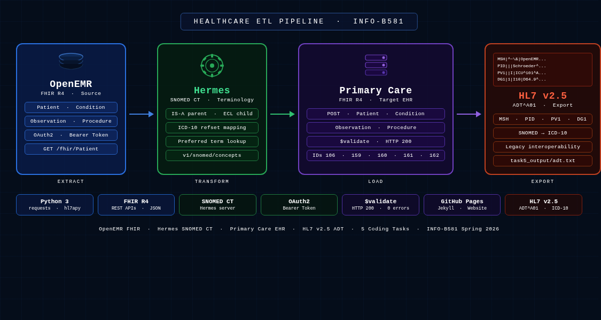
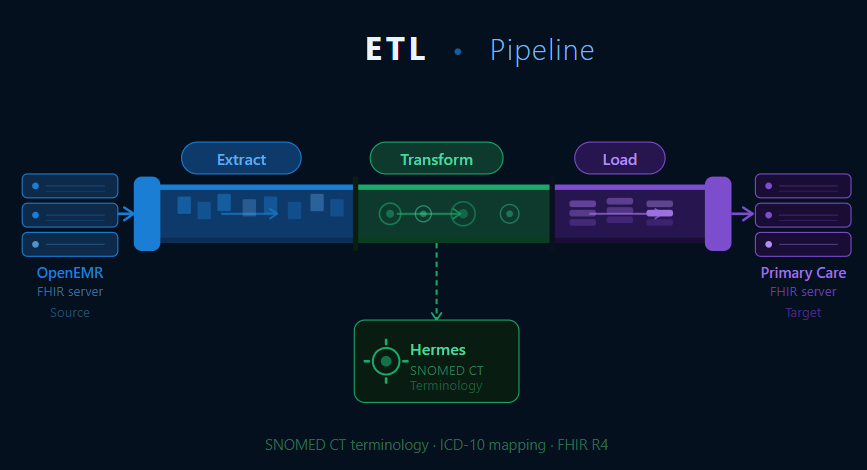

  

    
INFO-B581 · Spring 2026 · Final Project

    <h1 class="glow-text">Healthcare ETL Pipeline for FHIR Data</h1>
    
A Python-driven Extract–Transform–Load pipeline connecting OpenEMR, the Hermes SNOMED CT terminology server, and a Primary Care EHR, producing validated FHIR resources and a standards-compliant HL7 v2.5 ADT message.

    <nav class="dark-nav">
      <strong>Navigate:</strong>
      <a href="index.html" style="color:#ffffff!important;text-shadow:0 0 10px #4db8ff;text-decoration:none;">Home</a> |
      <a href="etl_pipeline.html">ETL Pipeline</a> |
      <a href="insights.html">Insights</a> |
      <a href="team_contributions.html">Team Contributions</a> |
      <a href="about.html">About / Presentation</a>
    </nav>
  

---

## Project Overview

- Builds a healthcare ETL pipeline to transfer patient data between systems.
- Extracts healthcare data from OpenEMR using FHIR APIs.
- Transforms clinical terminology using Hermes SNOMED CT mappings.
- Loads validated resources into the Primary Care FHIR Server.
- Demonstrates secure, standardized, and interoperable healthcare data exchange.

  

    <h3>Goal</h3>
    

      Design a reproducible Python-based ETL workflow that extracts healthcare data using FHIR APIs, transforms clinical concepts with SNOMED CT mappings, loads standardized resources into a target FHIR server, validates data using $validate, and demonstrates interoperability through HL7 v2 message generation.
    

  

  

    <h3>Technologies</h3>
    

      <strong>Python 3</strong> – ETL scripting &amp; automation 
      <strong>Requests Library</strong> – API communication 
      <strong>PyCharm</strong> – Development environment 
      <strong>Postman</strong> – API testing &amp; validation 
      <strong>FHIR R4 REST APIs</strong> – Healthcare data exchange 
      <strong>SNOMED CT</strong> – Clinical terminology mapping 
      <strong>HL7apy</strong> – HL7 v2 message generation 
      <strong>Git &amp; GitHub</strong> – Version control 
      <strong>GitHub Pages</strong> – Project website hosting
    

  

  

    <h3>Data Sources</h3>
    

      <strong>Source System – OpenEMR FHIR API Server</strong> 
      Provides live healthcare resources including Patients, Conditions, Observations, and Procedures.  
      <strong>Terminology Source – Hermes SNOMED CT Server</strong> 
      Used for parent/child concept lookup, preferred terms, and ICD mapping.  
      <strong>Target System – Primary Care FHIR Server</strong> 
      Stores transformed, validated healthcare resources.
    

  

  

    <h3>Outcomes</h3>
    

      <strong>Task 1 &amp; 2:</strong> Created Patient and Condition resources using SNOMED mappings.  
      <strong>Task 3:</strong> Generated Blood Pressure Observation using LOINC coding.  
      <strong>Task 4 &amp; 5:</strong> Created Procedure resource and generated HL7 v2 ADT message.
    

  

---

## ETL Pipeline at a Glance

1. **Data Extraction** – Retrieved Patients, Conditions, Observations, and Procedures from OpenEMR.
2. **Terminology Transformation** – Used Hermes SNOMED CT for parent/child concept mapping.
3. **Resource Loading** – Created standardized resources in the Primary Care FHIR server.
4. **Validate** – Verified Patient and Condition resources using $validate.
5. **Interoperability Output** – Generated HL7 v2 ADT message for legacy systems.
6. **Project Outcome** – Demonstrated automated healthcare ETL using Python.

---

## Summary of Deliverables

- **ETL Pipeline** – Python ETL workflow
- **FHIR Integration** – Retrieved Patient, Condition, Observation, Procedure
- **Terminology Mapping** – SNOMED CT parent/child mappings
- **Resource Creation** – Standardized FHIR resources
- **HL7 Output** – HL7 v2 ADT message
- **Validation** – FHIR $validate
- **Project Website** – Documentation + workflow

---

## Quick Links

- [ETL Pipeline Documentation](etl_pipeline.html)
- [Insights](insights.html)
- [Team](team_contributions.html)
- [About](about.html)

---
