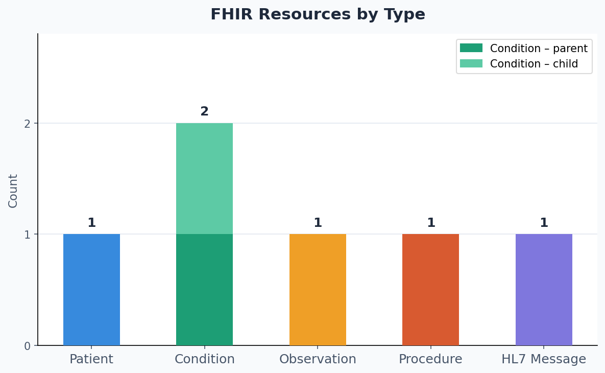

<style>
h2 { color:#22c55e !important; font-size:34px; font-weight:800; margin-top:40px; }
h3 { color:#22c55e !important; font-size:26px; font-weight:700; }
.immersive-header-container {
  background: linear-gradient(135deg, #020c1b 0%, #0a2a5e 60%, #0d3d6b 100%);
  color: #fff;
  margin-left: -30px; margin-right: -30px;
  padding: 2.5rem 1.5rem 2rem;
  border-radius: 0 0 24px 24px;
  box-shadow: 0 12px 40px rgba(0,0,0,0.5);
  margin-bottom: 3rem;
}
.header-content-wrapper { max-width: 920px; margin: 0 auto; text-align: center; }
.header-badge { display: inline-block; background: rgba(0,180,255,0.15); border: 1px solid rgba(0,180,255,0.4); color: #7dd3fc; font-size: 0.78rem; font-weight: 700; letter-spacing: 0.12em; text-transform: uppercase; padding: 0.3rem 1rem; border-radius: 100px; margin-bottom: 1rem; }
.glow-text { color: #fff; text-shadow: 0 0 30px rgba(0,150,255,0.8); margin: 0.5rem 0 0.6rem; font-size: 2.2rem; font-weight: 800; }
.header-subtitle { color: #93c5fd; font-size: 0.95rem; margin-bottom: 1.4rem; }
.dark-nav { background: rgba(255,255,255,0.05); border: 1px solid rgba(255,255,255,0.15); padding: 0.7rem 1.2rem; border-radius: 50px; color: #ccc; display: inline-block; backdrop-filter: blur(8px); font-size: 0.9rem; }
.dark-nav strong { color: #fff; margin-right: 6px; }
.dark-nav a { color: #4db8ff !important; text-decoration: none; padding: 0 5px; transition: all 0.25s; }
.dark-nav a:hover { color: #fff !important; text-shadow: 0 0 10px #4db8ff; }
</style>

<div class="immersive-header-container">
  <div class="header-content-wrapper">
    <div class="header-badge">Key Findings &amp; Reflections</div>
    <h1 class="glow-text">Insights &amp; Lessons Learned</h1>
    <p class="header-subtitle">What building a realistic healthcare ETL pipeline taught us about FHIR, SNOMED CT, and data quality</p>
    <nav class="dark-nav">
      <strong>Navigate:</strong>
      <a href="index.html">Home</a> |
      <a href="etl_pipeline.html">ETL Pipeline</a> |
      <a href="insights.html" style="color:#ffffff!important;text-shadow:0 0 10px #4db8ff;text-decoration:none;">Insights</a> |
      <a href="team_contributions.html">Team Contributions</a> |
      <a href="about.html">About / Presentation</a>
    </nav>
  </div>
</div>

## Overview

This page presents key insights from our ETL pipeline project that transfers healthcare data from the OpenEMR FHIR server to the Primary Care FHIR server using the Hermes SNOMED CT terminology server.
Working with Katherine Schroeder's realistic clinical training record in the OpenEMR FHIR server surfaced several findings that ideal examples don't prepare you for.

**Selected Patient:** Katherine Schroeder (Female)  
**Patient DOB:** 1951-10-26  
**Condition Used:** Anemia  
**Procedure Created:** Intravenous blood transfusion of packed cells (SNOMED: 180207008)  
**Blood Pressure:** 124/73 mmHg   
**Total Resources Created:** 5 FHIR resources + 1 HL7 v2 message

---

## Insight 1: FHIR Search Makes Data Retrieval Efficient

We used FHIR filters to locate the correct patient quickly.

```text
GET /Patient?gender=female&birthdate=gt1951-01-01&_lastUpdated=gt2020-01-01
```

### Lesson Learned

- FHIR APIs support fast and accurate patient search
- Search parameters improve ETL performance
- Standard APIs simplify integration

---

## Insight 2: SNOMED CT Improves Clinical Standardization

Hermes terminology services helped us transform diagnosis codes.

| Task | Purpose |
|------|---------|
| Task 1 | Parent Condition |
| Task 2 | Child Condition |
| Task 5 | SNOMED to ICD-10 Mapping |

### Lesson Learned

- Standard terminology improves interoperability
- Parent and child concepts improve clinical matching
- Automated mapping reduces manual work

---

## Insight 3: Validation Improves Data Quality

Resources were checked before loading.

```text
POST /Patient/$validate
POST /Condition/$validate
```

### Result

- Patient validated successfully
- Parent Condition validated successfully
- Child Condition validated successfully

---

## Insight 4: Real Healthcare Data Is Often Incomplete

| Issue | Solution |
|------|----------|
| BP values absent in FHIR API response | Loaded actual 124/73 from JSON |
| No procedure fetched | Created clinically relevant blood transfusion procedure |
| Missing required fields | Added during transform |

### Lesson Learned

ETL pipelines need fallback logic for real-world healthcare data.

---

## Insight 5: Common ETL Pattern

### 1. Extract

Retrieve patient and clinical data from OpenEMR.

### 2. Transform

Apply terminology mapping, formatting, defaults, and validation rules.

### 3. Load

Create resources in the Primary Care FHIR server or export HL7 file.

---

## Insight 6: ICD-10 Mapping Can Be Fully Automated

Task 5 demonstrated something practically significant - the pipeline needed no hardcoded ICD-10 codes. The entire SNOMED → ICD-10 translation was resolved at runtime.

## HL7 Field Mapping Summary

| FHIR Field | HL7 v2 Segment / Field | Actual Value Used |
|-----------|------------------------|------------------|
| Patient.id | PID-3 | 9d035918-b974-4996-b35f-4b913d70f9fd |
| Patient.name family + given | PID-5 | Schroeder^Katherine |
| Patient.birthDate | PID-7 | 1951-10-26 → 19511026 |
| Patient.gender | PID-8 | female → F |
| Patient.address city/state | PID-11 | ^^Leominster^Massachusetts |
| Condition SNOMED 271737000 | DG1-3 (code) | D64.9 via Hermes refsets |
| SNOMED preferred term | DG1-3 (display) | Anemia from Hermes |

The map advice returned by Hermes was **"ALWAYS D64.9"** - meaning for SNOMED concept `271737000`, there is no ambiguity and the mapping is definitive.

---

## Resources Created Across Tasks & Visualization

| Task | Output |
|------|--------|
| Task 1 | Patient + Parent Condition |
| Task 2 | Child Condition |
| Task 3 | Blood Pressure Observation |
| Task 4 | Procedure |
| Task 5 | HL7 v2 ADT Message |



- 5 resource types were successfully created across the ETL pipeline : Patient, Condition, Observation, Procedure, and an HL7 v2 Message.
- Condition is the only resource with 2 entries, shown as a stacked bar, because it holds both a parent SNOMED concept and a child concept.
  
---

## Challenges Faced

- OAuth token expiry during API calls
- Many non-clinical conditions in source record
- BP values absent in FHIR API response
- No procedure records available
- Validation field mismatches

---

## Future Improvements

- Automatic token refresh
- Better logging dashboard
- Multi-patient batch processing
- Unit testing workflows
- Performance monitoring

---

## Best Practices Followed

- Used standard FHIR APIs
- Applied SNOMED CT mappings
- Validated resources before loading
- Reused saved patient IDs
- Added fallback defaults
- Generated FHIR and HL7 outputs

---

## Technologies Applied

- FHIR APIs
- SNOMED CT
- HL7 v2
- Python (Requests, JSON, ETL scripting)

The project reflects a realistic healthcare ETL implementation using industry standards.

---

## Value for a Healthcare Organization

> Imagine you are the Health Informatics team at a regional clinic migrating legacy patient records to a new Primary Care EHR. This pipeline demonstrates exactly how that is done safely:
>
> - **Standardized Terminology:** SNOMED CT ensures the same diagnosis meaning across systems.
> - **Accurate Coding:** Automatic ICD-10 mapping reduces billing and coding errors.
> - **Better Data Quality:** Validation checks errors before data is stored.
> - **Legacy Compatibility:** HL7 v2 messages help connect with older hospital systems.
> - **Traceable Workflow:** Resource IDs confirm data was created successfully step by step.

---
